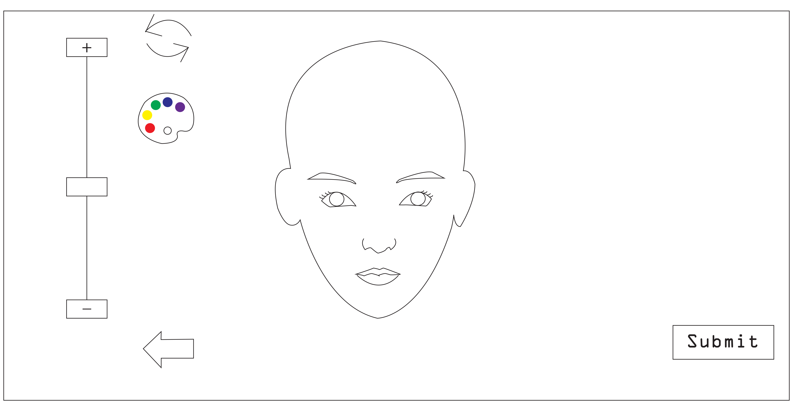
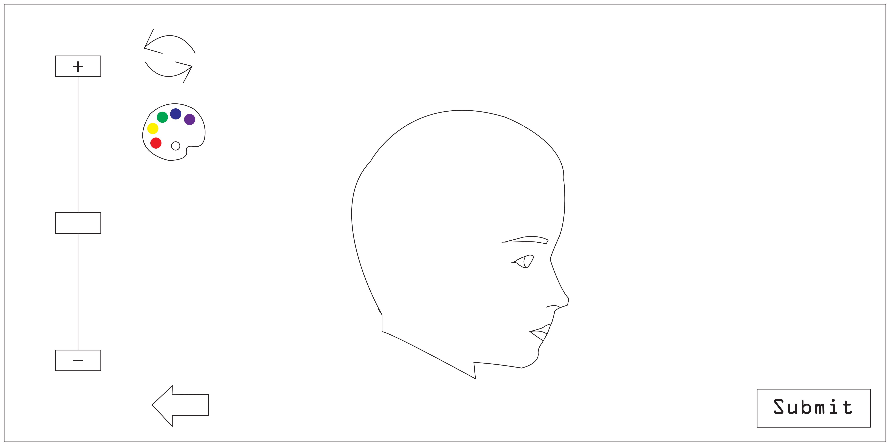
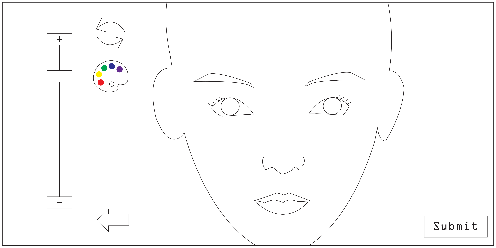
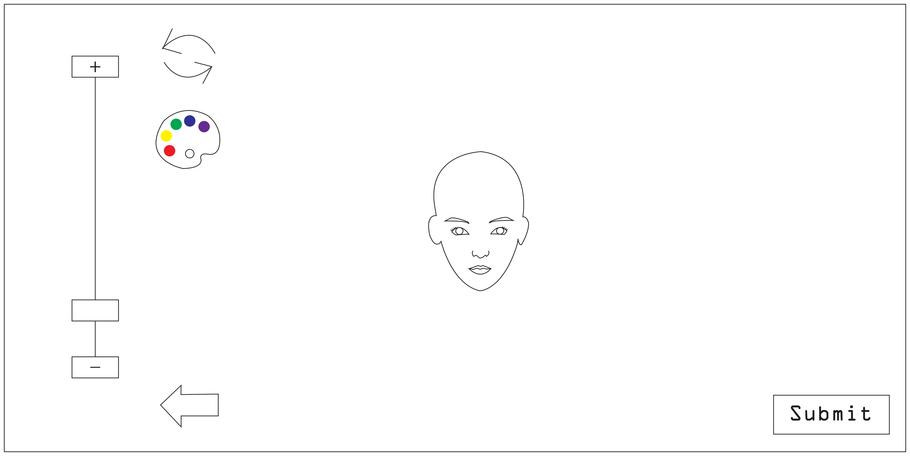
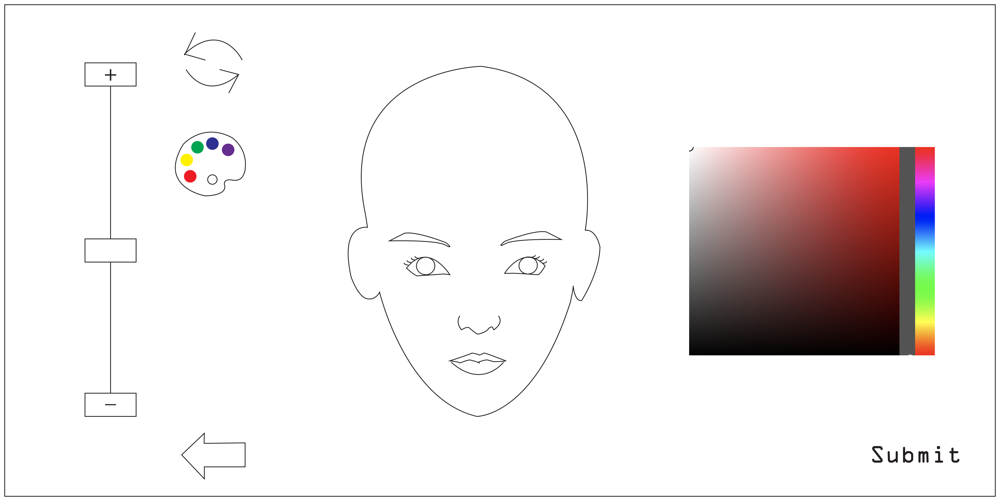
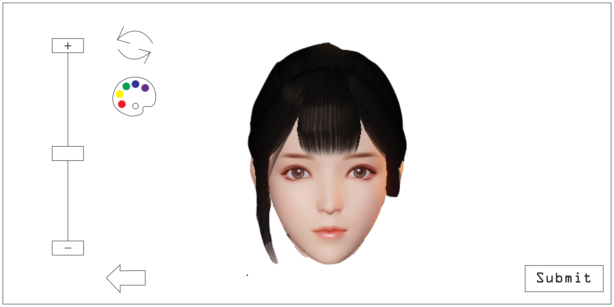
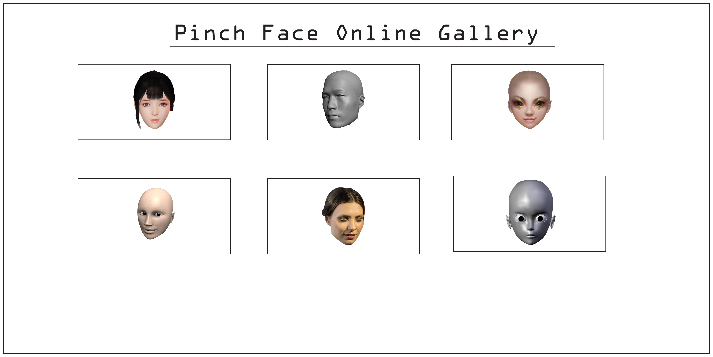

# Online Pinch Face Simulator

Online pinch face simulator is an online simulator that people can pinch and make faces by their own aesthetics on a basic face model. This simulator is aiming to solve a question about 3D modeling between audience and film producers that many audience think the CG effects in films are fake, cheap and some of them even look horrifying. Some audience even criticize film producers through social networks. But actually it is really hard and difficult for films producers to make perfect CG effects because they need to overcome the [Uncanny Valley](uncanny.md) situation. But most of the audience don't know this, and there raised a misunderstanding between audience and film producers. The online pinch face simulator can let the audience to experience the progress of pinching a face step by step and know the degree between a good CG technique face and a face that will cause anxiety in human psychology. In the online pinch face simulator, audience will use mouse as the main tool to pinch the face and there are other tools to help. After pinching and submitting the face, the system will scan the face and tell them the similarity between their pinching face and real human face by percentage. Finally, audience can view the online gallery of pinching faces that the system collected.

The basic page with a face model.

Audience can use the rotate tool to switch perspective while pinching the face.

Audience can use the plus and minus tool to zoom in and out the face.

Audience can use the palette tool to color the face they pinched.

An example face.

The page after audience submit the face.

The online gallery.
