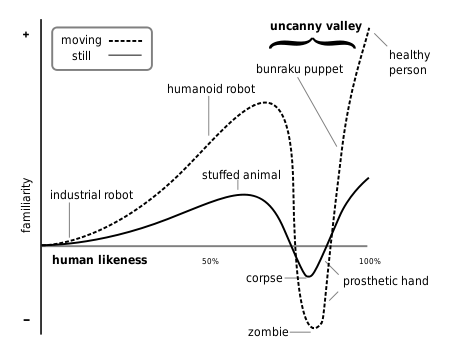
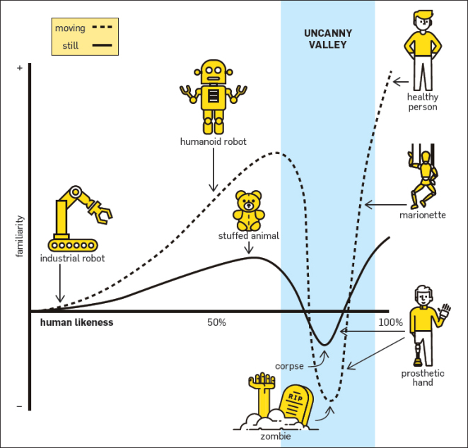

## What is the Uncanny Valley?

- In 1970, Japanese robotics expert Mori Masahiro proposed that if robots will become more and more like humans and they are similar to humans to a certain degree(95%), their slight imperfections in appearance will cause anxiety in human psychology.

This assumption certainly applies to the 3D modeling characters in CG films.
